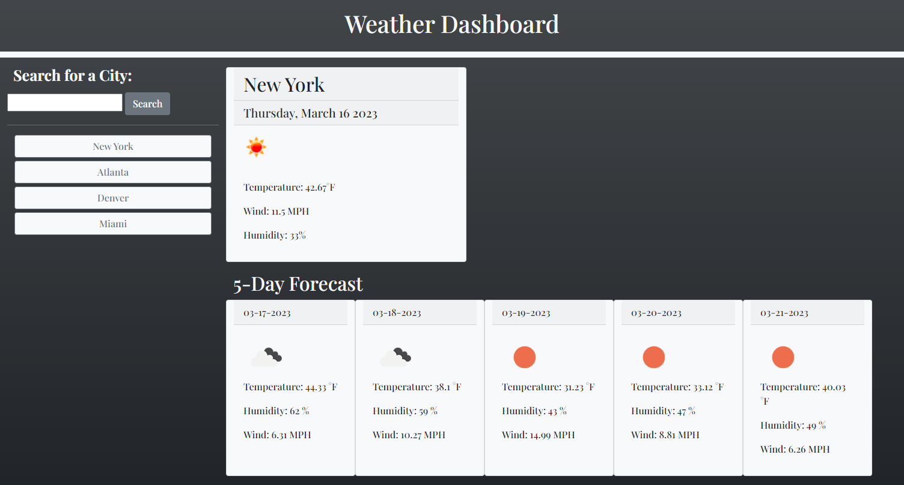

# Weather-Dashboard

>## Description 
This application was built with JavaScript and Boostrap to display the current weather forecast along with 5-day forecast data of a searched city. OpenWeather API is used to display the current weather data for a city along with a 5-day forecast. In addition, the searched or selected city is saved in local storage so that its information displays upon page reload.

>## Deployment/Installation

There is no installation required for this website. The webpage can be found by clicking the link below:

[Weather Dashboard](https://carolinapalacios95.github.io/Weather-Dashboard/)

>## Built With

This app runs in the browser and features dynamically updated HTML and CSS powered by jQuery.

  * HTML
  * CSS
  * Javascript
  * Bootstrap
  * jQuery
  * day.js
  * GoogleFonts

>## API Documentation
[OpenWeather API](https://openweathermap.org/api) 

>## User Story

```
AS A traveler
I WANT to see the weather outlook for multiple cities
SO THAT I can plan a trip accordingly
```

>## Acceptance Criteria 

```
GIVEN a weather dashboard with form inputs
WHEN I search for a city
THEN I am presented with current and future conditions for that city and that city is added to the search history
WHEN I view current weather conditions for that city
THEN I am presented with the city name, the date, an icon representation of weather conditions, the temperature, the humidity, and the the wind speed
WHEN I view future weather conditions for that city
THEN I am presented with a 5-day forecast that displays the date, an icon representation of weather conditions, the temperature, the wind speed, and the humidity
WHEN I click on a city in the search history
THEN I am again presented with current and future conditions for that city
```

>## Mock-Up/Demo

The following image shows the web application's appearance and functionality:



>## License
© 2023 edX Boot Camps LLC. Confidential and Proprietary. All Rights Reserved.
